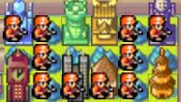
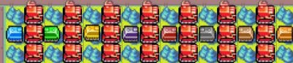
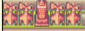
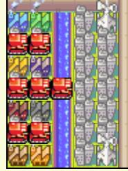
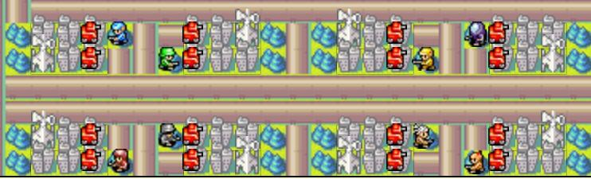

# Phantom Domain Rule Books
## Menu
1. [Set up](#set-up)
2. [Map](#map)
3. [Tokens](#tokens)
3. [Roles](#roles)
4. [Processing Order](#processing-order)
5. [MISC.](#misc)

## SET UP  

- Fog: On
- Lab Gating: Preferably None (*Maybe something to try at a later date with this setup.*)
- Following COs are **banned**:  

Banned CO | Reason
------------ | -------------
Sonja | South Segment Problems
Grit , Kanbei , Sensei ,  Hachi , Colin | Broken Five
Sturm, Rachel, Von Bolt, Drake, Hawke, Olaf, Kindle | Damage Abilities
Sasha | OP power for FFA

Orange Star **has to be Javier** and OS will be the games ***"Moderator"***.  
(*OS will be referred to as **mod** from now on*)  
Mod units **cannot attack** unless they are produced by the effect of tokens (*see tokens appendix*).

Set the game up as a free for all.  
The game is not truly free for all however due to the presence of roles (*refer to roles for more information*).  
The mod is not truly a player and is there to ensure the experience of the game does not go awry.  
If anyone has their win condition fulfilled, Mod will alert the rest of the players through broadcast to set draw and will eliminate all losers through means of the northeast HQ area.  

[Return to top](#phantom-domain-rule-books)

## MAP
### Section Menu
1. [Explanation of HQ Area](#explanation-of-hq-area)
2. [Explanation of NW APC Area](#explanation-of-nw-apc-area)
3. [Explanation of NE Towers](#explanation-of-ne-towers)
4. [Explanation of North West](#explanation-of-north-west)
5. [Explanation of North East](#explanation-of-north-east)
6. [Explanations of NE labs](#explanations-of-ne-labs)
7. [Main Map](#main-map)
8. [Main Map Mod](#main-map-mod)

[Return to top](#phantom-domain-rule-books)

### Explanation of HQ Area:
  
If a player is actively trying to break the rules, is considered defeated, or another player's victory condition is met, the infantry in this area will remove that player from the game. Abilities might be contrast to 2nd case.  
Removing players from the game in this way ensures a fast turn cycle.  
The mod has no other purpose for this infantry and will not capture all HQ's as a joke.  
Do not use this infantry for target practice if for some reason you can get a unit in range to fire upon it.  
The mods backup plan for you doing this is to send an arbitrarily large number of mega tanks and make the game less fun for you.  

[Return to Section Menu](#map) | [Return to top](#phantom-domain-rule-books)

### Explanation of NW APC Area:
  
At the start of the fifth day and every five days afterwords, The mod will publicly announce the winner(s) of the APC Lottery. (But not what they win.)  
To play the game, move your APC into one of the three available forests (top, middle or bottom).
The players in the row of forests with the least number of APCs are the winners.  
Prizes scale upwards for being the sole winner.  
Prizes are up to the Mod's discretion (I suggest tokens in the early game and abilities or helpers later on.)  
Players that gain vision of the Megatank(through their APC vision) are not allowed to fire on it.  

[Return to Section Menu](#map) | [Return to top](#phantom-domain-rule-books)

### Explanation of NE Towers:
  
Not intractable and serves to make some of the mods units much more difficult to kill.  
Also prevents some stupid luck things that could happen in the North East area.  

[Return to Section Menu](#map) | [Return to top](#phantom-domain-rule-books)

### Explanation of North West:  
  
At the start of the game, Mod will choose one (or more) player to be the Phantom anonymously.  
The mega tanks in the SW corner will cover the non-phantom players factories and leave the phantom the whole NW quadrant to capture giving them an advantage.  
Rivers around the factories prevent the phantom from building non-infantry units in that area.
Phantom players gain access to NW Area through abilities granting them the access.  

[Return to Section Menu](#map) | [Return to top](#phantom-domain-rule-books)

### Explanation of North East:  
  
The NE corner contains the questing area.  
The Mod recons will not attack the infantry here but serve as a blockade.  
The recons will move back at the cost of tokens. (See tokens appendix).  

[Return to Section Menu](#map) | [Return to top](#phantom-domain-rule-books)

### Explanations of NE labs:  
NE labs serve as a flag area. In the profile each player will be given a flag condition. If it is false mod will delete the infantry on his lab on day1. Flag conditions can be used for abilities and victory conditions. Flag areas are designed to discourage vision sharing to protect the phantom.  

[Return to Section Menu](#map) | [Return to top](#phantom-domain-rule-books)

### Main Map:  
The map will normally start out as a eight-way free for all with the final goal of each player being to complete their roles victory condition.  
Players are encouraged to form diplomatic groups as they try to complete their role's victory condition.  
Players are allowed to interact with mod units however they would like. However, the mod must follow specific rules listed here.  

[Return to Section Menu](#map) | [Return to top](#phantom-domain-rule-books)

### Main Map Mod:  
The mod must immediately dive their central submarines. Recons and subs must be built accordingly.  
No mod units can attack unless otherwise stated. (See tokens appendix).  

The mod city at the spawning location serves as a HQ and the player is considered defeated if the city is captured unless an ability claiming not.  

[Return to Section Menu](#map) | [Return to top](#phantom-domain-rule-books)

## TOKENS
### Section Menu
1. [Tokens Appendix](#tokens-appendix)
2. [Mod Labs](#mod-labs)
3. [Token Purchases](#token-purchases)

[Return to top](#phantom-domain-rule-books)

### Tokens Appendix
Everyone starts with zero tokens and tokens can only be gained in four ways.  
Those ways are:  
1. Sitting on Mod Labs - (See notes below.)  
2. APC Lottery - (See notes under Map - Explanation of South.)  
3. Role Abilities - (See examples under Roles.)  
4. Donation from Another Player - At any time, you may private press message the mod and choose to donate any number of tokens you have to another player.  

Possible uses include diplomacy or throwing other players off your trail by randomly changing your token count.    
You may choose to donate anonymously or allow the mod to include your country.  
Mod will press message you when your token count changes.  

[Return to Section Menu](#tokens) | [Return to top](#phantom-domain-rule-books)

### Mod Labs
At the start of the fifth day and every five days afterwords, any player with a unit on top of a mod lab will receive a token.  
You may capture mod labs however this will prevent the mod from seeing who is on top of them and therefore turning off their ability to give players tokens.  
Tokens will be recorded by the mod and will be sent to you in a private press message.  

[Return to Section Menu](#tokens) | [Return to top](#phantom-domain-rule-books)

### Token Purchases

#### SE Questing Area Purchase 
*1 Token*  
Moves a Mod recon back two spaces. (You may use this ability on other countries but if you don't specify it will be assumed you use it on your own.)  
*NOTE: On the pocket edition map, each recon in your zone will instead move back one space each.*    
#### Anonymous Mod Broadcast Message 
*1 Token*  
Private Press Message the Mod, they will broadcast your message anonymously.  
#### Reconnaissance Scout  
*2 Tokens*  
Mod private press messages you a link to an image of the mod's central piperunner's, recon's, and sub's vision range. (You may share the link freely if you choose to.)  
#### Mod Lab Information  
*2 Tokens*  
The mod messages you with all information of the current units on top of all mod labs. Info includes: Country, Fuel, Ammo, Health and Unit.  
#### Activate Mod Piperunners  
*3 Tokens*  
Message Mod a country. For the next five days, Mod piperunners will be allowed to attack units of that country. (You may choose to target your own country.)  
#### Helper Unit Purchase Log  
*3 Tokens*  
The mod messages you with the purchase history of mod units of target country. (Includes day sent, where it was sent, and what unit was sent.)  
#### Mod Helper Units
Message the Mod a country. Produces and sends the unit towards that country's base and only attacks that country's units. You may choose to target yourself.  

Units | Cost
------------ | -------------
Mod Tank | 2 Tokens
Mod Anti-Air | 2 Tokens 
Mod Battle Copter | 3 Tokens
Mod Medium Tank | 4 Tokens
Mod Fighter | 4 Tokens
Mod Neotank | 5 Tokens 
Mod Bomber | 5 Tokens
Mod Mega Tank | 6 Tokens

Price **rises by 50%** for **each 2** extra towers OS obtained by HQ capping.

Mod helper units will be produced at the facility closest to their target. When the facility is occupied mod will produce the units from the nearest facilities. Mod will use available piperunners(no other mission assigned) to clear the road tiles next to the subs when mod units cannot leave the base as a result of players' blocking.

**Mod Helper units AI:** Mod helper units will move towards the original start location of the target country until they die. (factory--normal units&APC/airport--fighter&Tcopter)They will not attempt to refuel or repair and will attempt to attack the  unit with the highest cost within Mod's vision.  

[Return to Section Menu](#tokens) | [Return to top](#phantom-domain-rule-books)

## ROLES

Roles are given to players at the beginning of the game in the profile. Roles are random and are up to the mod's discretion to allow the correction of handicaps and to give each individual player a specialty.  
The phantom will always receive the phantom role (*but may choose to bluff their ability to try to fool other players into thinking they are not the phantom.*)  

Roles are private press messages on the mod's day one.  
Roles are formatted as the following: (Examples Below)  
*These examples include theoretical abilities, these are **not the only possible** roles and abilities are **not locked** based on what alliance your role is.*  

- **Player1**  
  - **Alliance**: Evil (Phantom)  
  - **Victory Condition**: 
    1. All players with the "Good" alliance are defeated.  
    2. At least one member of alliance evil survives. 
    3. No other victory condition is met.  
  - **Abilitiy_example_ability1**: You may attempt to steal 1 to 6 tokens (at random) from another target country. The ability can be activated on day5 and every 5 days afterward. *(active)*
- **Player2**
  - **Alliance**: Neutral
  - **Victory Condition**: 
    1. Win APC lottery for 4 times. 
    2. Survive until condition1 is met. 
    3. No other victory condition is met.
  - **Ability_example_ability2**: You will be warned whenever a player sends a mod helper unit after you. *(This will be a private press message including unit type and country who is sending it.)* *(passive)*
- **Player3**
  - **Alliance**: Good
  - **Win Condition**: 
    1. All players with the "Evil" alliance are defeated. 
    2. At least one good player survives. 
    3. No other victory condition is met.
  - **Ability_example_ability3**: You have knowledge of all players token count. (rule)

Defeating Players: A player is considered defeated when one of the following conditions is met:  
1) The mod city that is located by that players starting areas pad is captured.
2) An effect or ability of another player causes that player to be defeated.
3) That player leaves the game, resigns, or is booted by the system.
When a player is defeated, they will have two turns to say goodbye as the mod captures their headquarters unless an ability claiming not.

I don't always copy paste these exact role layouts but this is a good example.  

It is possible to have several phantoms in a game. If there is, they will share the South-most West corner.  

[Return to top](#phantom-domain-rule-books)

## Processing Order

For a fair game play mod will deal with all requests(mod service & active abilities & gifting) in his turns in received orders. Passive abilities are dealt with in turn orders if activated at the same time. Rule abilities work automatically.  
Processing order  
1. Dealing with the requests of the day before.  
*--the beginning of the day--*
2. Giving tokens for labs occupied (special)
3. APC lottery (special)
4. Check Elimination & HQ capturing
5. Check Victory Conditions
6. Activate piperunners
7. Move Mod units(The order is optimized)
8. Build Mod units
9. Take screenshots
*--END TURN--*

[Return to top](#phantom-domain-rule-books)

## MISC.  
### Section Menu  
1. [Histroy Version](#histroy-version)
2. [Game Record](#game-record)
3. [Last Word](#last-word)

[Return to top](#phantom-domain-rule-books)

### Histroy Version

Map | Creator | Publish time
--- | -------- | ----
[Phantom Domain Alpha](http://awbw.amarriner.com/prevmaps.php?maps_id=66452) | [Urbani](https://awbw.amarriner.com/profile.php?username=Urbani) | 04/03/2015 
[Phantom Domain Beta](http://awbw.amarriner.com/prevmaps.php?maps_id=66497) |  [Urbani](https://awbw.amarriner.com/profile.php?username=Urbani) | 04/08/2015 
[Phantom Domain](http://awbw.amarriner.com/prevmaps.php?maps_id=67885) | [Urbani](https://awbw.amarriner.com/profile.php?username=Urbani) | 01/04/2016
[Phantom Domain Pocket Edition](http://awbw.amarriner.com/prevmaps.php?maps_id=69419) | [Urbani](https://awbw.amarriner.com/profile.php?username=Urbani) | 09/05/2016
[Pocket version in use](https://awbw.amarriner.com/prevmaps.php?maps_id=70399) | [a9977321](https://awbw.amarriner.com/profile.php?username=a9977321) | 02/03/2017

[Return to Section Menu](#misc) | [Return to top](#phantom-domain-rule-books)

### Game Record
- 4 tower test Feb.5th, 2017-Sept.5th, 2017 Day29 Evil Victory: ichbinsehselber, Jackie Milton
phantom domain November Feb. 22nd, 2018- ongoing

[Return to Section Menu](#misc) | [Return to top](#phantom-domain-rule-books)

### Last Word
Press and Broadcasts are encouraged and you will have your tokens tracked for you by the Mod.  

*--Leave a comment with any questions you have!--*

[Return to Section Menu](#misc) | [Return to top](#phantom-domain-rule-books)
